# Architecture de l'Application GNV OnBoard

## Vue d'ensemble

L'application GNV OnBoard est une application web complète pour les passagers de ferry, composée de trois applications principales :

1. **Frontend Principal** (Port 5173) - Application pour les passagers
2. **Backend API** (Port 3000) - API REST avec WebSocket
3. **Dashboard Admin** (Port 5174) - Interface d'administration

---

## Architecture Générale

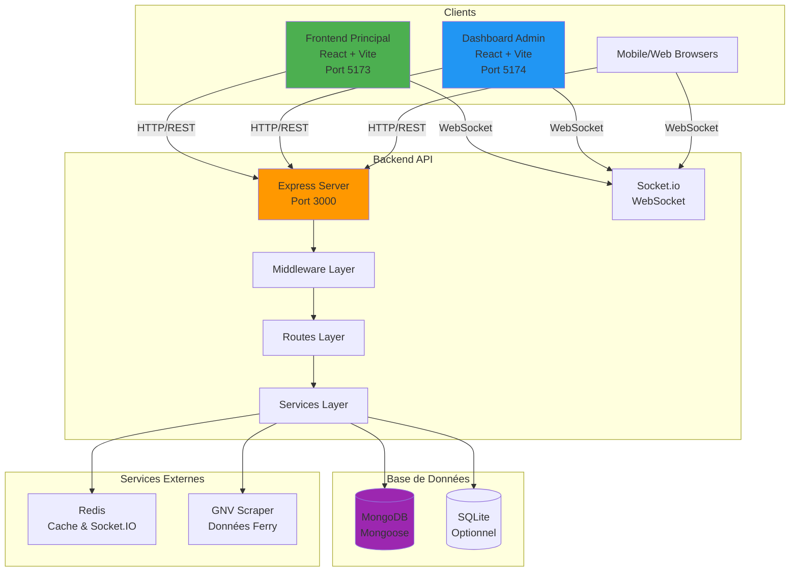

---

## Structure des Dossiers

```
appli-final-copie/
│
├── 📁 backend/                    # API Backend Node.js/Express
│   ├── 📁 src/
│   │   ├── 📁 lib/                # Bibliothèques utilitaires
│   │   │   ├── database.js        # Connexion MongoDB (Mongoose)
│   │   │   ├── database-optimized.js
│   │   │   ├── cache-manager.js   # Gestion du cache
│   │   │   ├── connection-manager.js
│   │   │   └── prisma.js          # Client Prisma (scripts uniquement, non utilisé par les routes)
│   │   │
│   │   ├── 📁 middleware/         # Middlewares Express
│   │   │   ├── auth.js            # Authentification JWT
│   │   │   ├── validation.js      # Validation des données
│   │   │   ├── language.js        # Gestion multilingue
│   │   │   └── demo.js            # Mode démo
│   │   │
│   │   ├── 📁 models/              # Modèles de données
│   │   │   ├── User.js
│   │   │   ├── Restaurant.js
│   │   │   ├── Product.js
│   │   │   ├── Article.js
│   │   │   ├── Banner.js
│   │   │   ├── Ship.js
│   │   │   ├── Shipmap.js
│   │   │   ├── WebTVChannel.js
│   │   │   ├── EnfantActivity.js
│   │   │   ├── Destination.js
│   │   │   ├── Message.js
│   │   │   └── Feedback.js
│   │   │
│   │   ├── 📁 routes/              # Routes API
│   │   │   ├── auth.js            # /api/auth
│   │   │   ├── users.js           # /api/users
│   │   │   ├── restaurants.js    # /api/restaurants
│   │   │   ├── movies.js          # /api/movies
│   │   │   ├── radio.js           # /api/radio
│   │   │   ├── magazine.js        # /api/magazine
│   │   │   ├── shop.js            # /api/shop
│   │   │   ├── messages.js        # /api/messages
│   │   │   ├── feedback.js        # /api/feedback
│   │   │   ├── admin.js           # /api/admin
│   │   │   ├── analytics.js       # /api/analytics
│   │   │   ├── gnv.js             # /api/gnv
│   │   │   └── demo.js            # /api/demo
│   │   │
│   │   ├── 📁 services/            # Services métier
│   │   │   └── gnvScraper.js      # Scraping données GNV
│   │   │
│   │   └── 📁 modules/             # Modules modulaires
│   │       ├── auth/
│   │       ├── users/
│   │       └── restaurants/
│   │
│   ├── 📁 prisma/                 # Schémas Prisma
│   │   ├── schema.prisma          # Schéma MongoDB
│   │   └── schema-sqlite.prisma   # Schéma SQLite (optionnel)
│   │
│   ├── 📁 scripts/                # Scripts utilitaires
│   │   ├── init-database.js
│   │   └── init-database-prisma.js
│   │
│   ├── server.js                  # Point d'entrée principal
│   ├── server.optimized.js        # Version optimisée
│   └── server.production.js       # Version production
│
├── 📁 src/                        # Frontend Principal (Passagers)
│   ├── 📁 components/             # Composants React
│   │   └── LanguageSelector.jsx
│   │
│   ├── 📁 contexts/               # Contextes React
│   │   └── LanguageContext.jsx    # Gestion multilingue
│   │
│   ├── 📁 services/               # Services API
│   │   └── apiService.js          # Client API
│   │
│   ├── 📁 locales/                # Fichiers de traduction
│   │   ├── fr.json
│   │   ├── en.json
│   │   ├── es.json
│   │   ├── it.json
│   │   ├── ar.json
│   │   └── de.json
│   │
│   ├── 📁 data/                   # Données statiques
│   │   └── ships.js
│   │
│   ├── App.jsx                    # Composant principal
│   ├── main.jsx                   # Point d'entrée
│   └── index.css                  # Styles globaux
│
├── 📁 dashboard/                  # Dashboard Admin
│   └── 📁 src/
│       ├── 📁 components/         # Composants réutilisables
│       │   ├── Sidebar.jsx
│       │   ├── Header.jsx
│       │   ├── FilterBar.jsx
│       │   └── LanguageSelector.jsx
│       │
│       ├── 📁 pages/              # Pages du dashboard
│       │   ├── Dashboard.jsx     # Vue d'ensemble
│       │   ├── Login.jsx         # Authentification
│       │   ├── Analytics.jsx     # Statistiques
│       │   ├── Users.jsx         # Gestion utilisateurs
│       │   ├── Restaurants.jsx   # Gestion restaurants
│       │   ├── Movies.jsx        # Gestion films
│       │   ├── Radio.jsx         # Gestion radio
│       │   ├── Magazine.jsx      # Gestion magazine
│       │   ├── Shop.jsx          # Gestion boutique
│       │   ├── Messages.jsx      # Gestion messages
│       │   ├── Feedback.jsx      # Gestion feedback
│       │   ├── Banners.jsx       # Gestion bannières
│       │   ├── Bateaux.jsx       # Gestion bateaux
│       │   ├── Destinations.jsx  # Gestion destinations
│       │   ├── Shipmap.jsx       # Carte du navire
│       │   ├── Enfant.jsx        # Activités enfants
│       │   ├── WebTV.jsx         # WebTV
│       │   └── Library.jsx       # Bibliothèque
│       │
│       ├── 📁 services/           # Services API
│       │   ├── apiService.js
│       │   ├── authService.js
│       │   └── mockData.js
│       │
│       ├── 📁 contexts/           # Contextes React
│       │   └── LanguageContext.jsx
│       │
│       ├── 📁 locales/            # Traductions
│       │   ├── fr.json
│       │   ├── en.json
│       │   ├── es.json
│       │   ├── it.json
│       │   └── ar.json
│       │
│       ├── App.jsx                # Composant principal
│       └── main.jsx               # Point d'entrée
│
├── package.json                   # Dépendances frontend
├── vite.config.js                # Configuration Vite
├── tailwind.config.js            # Configuration Tailwind
└── start-all.sh                  # Script de démarrage
```

---

## Architecture Backend

### Flux de Requête API

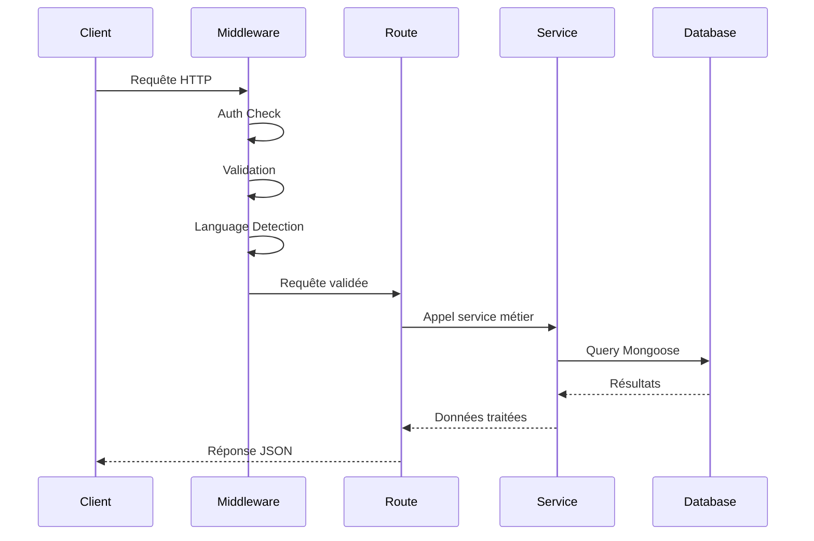

### Structure des Routes API

```mermaid
graph LR
    A[Express App] --> B[/api/auth]
    A --> C[/api/users]
    A --> D[/api/restaurants]
    A --> E[/api/movies]
    A --> F[/api/radio]
    A --> G[/api/magazine]
    A --> H[/api/shop]
    A --> I[/api/messages]
    A --> J[/api/feedback]
    A --> K[/api/admin]
    A --> L[/api/analytics]
    A --> M[/api/gnv]
    A --> N[/api/demo]
    A --> O[/api/health]
    
    style A fill:#FF9800
    style B fill:#4CAF50
    style K fill:#F44336
```

### Modèles de Données (Mongoose — API ; schéma Prisma pour scripts)

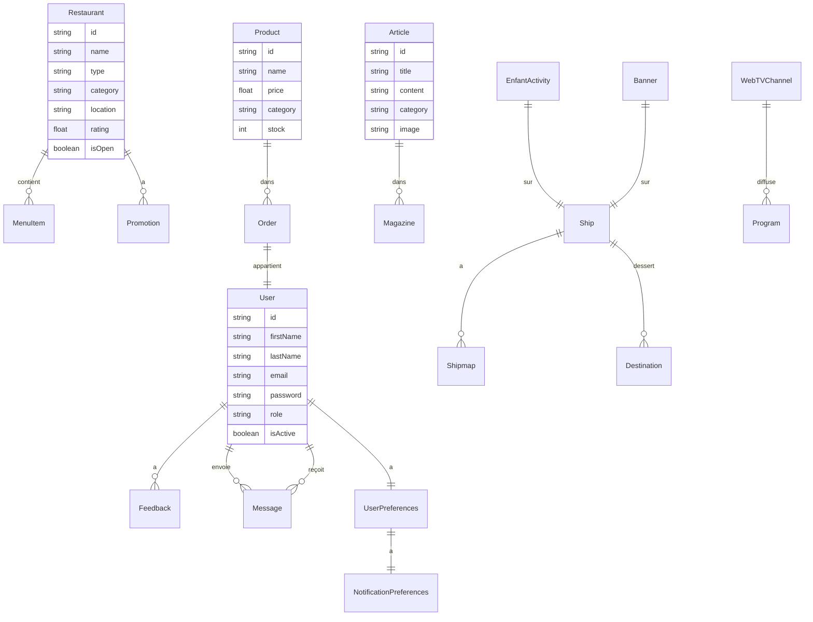

---

## Architecture Frontend

### Frontend Principal (Passagers)

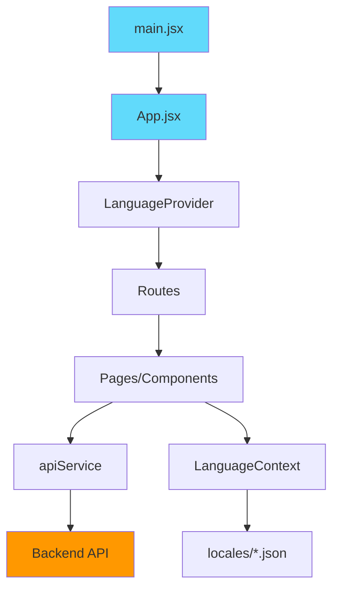

### Dashboard Admin

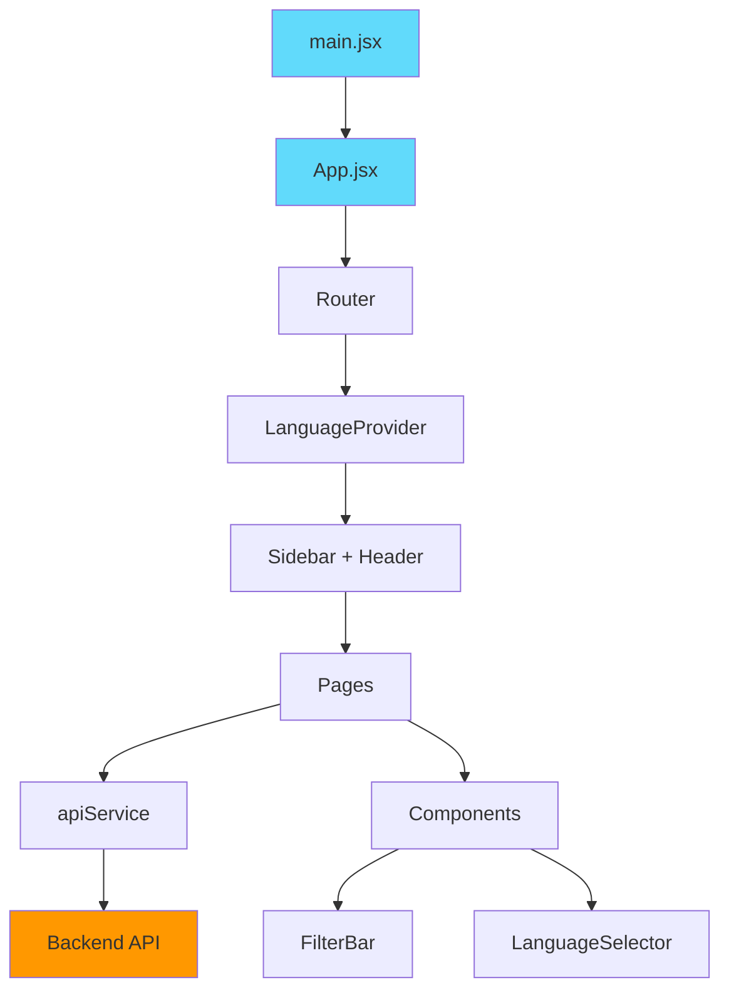

### Flux de Données Frontend

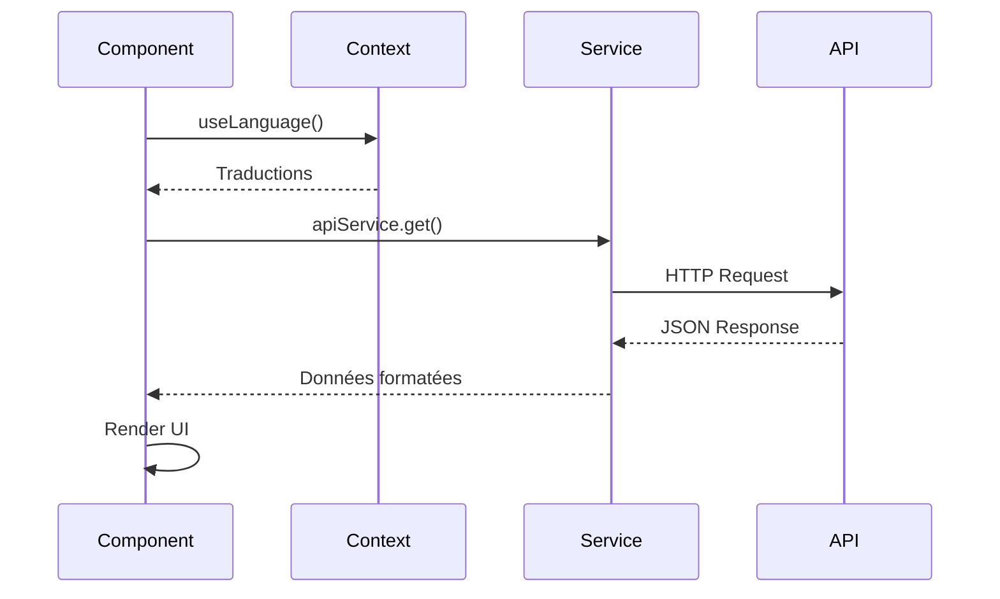

---

## Technologies Utilisées

### Backend
- **Runtime**: Node.js
- **Framework**: Express.js
- **ORM**: Mongoose (API) ; Prisma présent pour schéma et scripts (init-database-prisma), non utilisé par les routes
- **Base de données**: MongoDB (principal), SQLite (optionnel)
- **WebSocket**: Socket.io
- **Cache**: Redis (optionnel)
- **Authentification**: JWT (jsonwebtoken)
- **Validation**: express-validator
- **Sécurité**: Helmet, CORS, Rate Limiting
- **Logging**: Morgan

### Frontend Principal
- **Framework**: React 18
- **Build Tool**: Vite
- **Styling**: Tailwind CSS
- **Animations**: Framer Motion
- **Icons**: Lucide React
- **HTTP Client**: Axios
- **WebSocket**: Socket.io-client
- **Routing**: React Router (si nécessaire)

### Dashboard Admin
- **Framework**: React 18
- **Build Tool**: Vite
- **Styling**: Tailwind CSS
- **Charts**: Recharts
- **Notifications**: React Hot Toast
- **Routing**: React Router DOM
- **HTTP Client**: Axios
- **Icons**: Lucide React
- **Date**: date-fns

---

## Communication Inter-Services

### REST API Endpoints

| Endpoint | Méthode | Description | Auth |
|----------|---------|-------------|------|
| `/api/health` | GET | Health check | ❌ |
| `/api/auth/login` | POST | Connexion | ❌ |
| `/api/auth/register` | POST | Inscription | ❌ |
| `/api/users` | GET | Liste utilisateurs | ✅ |
| `/api/users/:id` | GET | Détails utilisateur | ✅ |
| `/api/restaurants` | GET | Liste restaurants | ❌ |
| `/api/restaurants/:id` | GET | Détails restaurant | ❌ |
| `/api/movies` | GET | Liste films | ❌ |
| `/api/radio` | GET | Stations radio | ❌ |
| `/api/magazine` | GET | Articles magazine | ❌ |
| `/api/shop/products` | GET | Produits boutique | ❌ |
| `/api/messages` | GET/POST | Messages | ✅ |
| `/api/feedback` | GET/POST | Feedback | ✅ |
| `/api/admin/*` | * | Routes admin | ✅ Admin |
| `/api/analytics` | GET | Statistiques | ✅ Admin |
| `/api/demo/*` | * | Données démo | ❌ |

### WebSocket Events

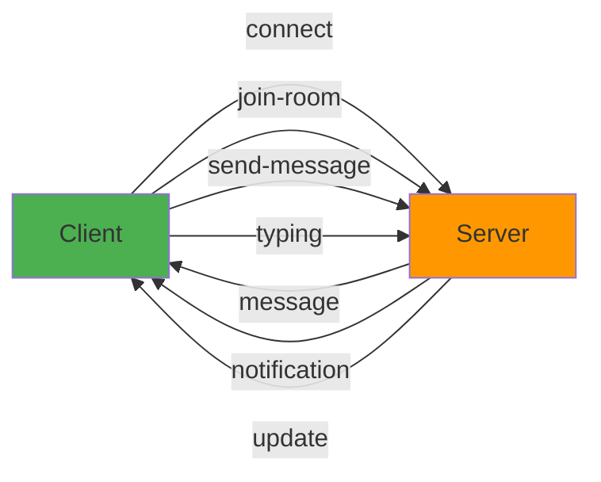

**Événements Socket.io**:
- `connection` - Connexion client
- `join-room` - Rejoindre une salle (ferry, restaurant, etc.)
- `send-message` - Envoyer un message
- `typing` - Indicateur de frappe
- `message` - Nouveau message reçu
- `notification` - Notification push
- `update` - Mise à jour en temps réel

---

## Sécurité

### Middleware de Sécurité

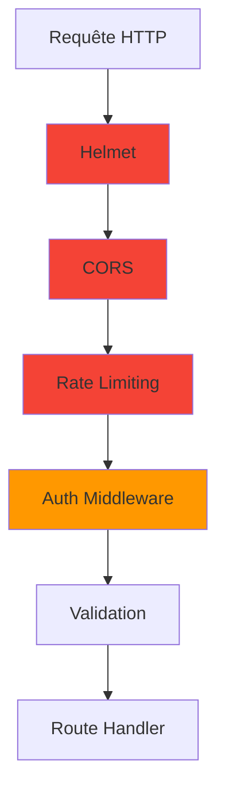

**Mesures de sécurité**:
- ✅ Helmet.js - Headers de sécurité HTTP
- ✅ CORS - Contrôle d'accès cross-origin
- ✅ Rate Limiting - Limitation du taux de requêtes
- ✅ JWT Authentication - Authentification par token
- ✅ Input Validation - Validation des données d'entrée
- ✅ Password Hashing - Hashage bcrypt
- ✅ SQL Injection Protection - Mongoose ORM

---

## Gestion Multilingue

### Architecture i18n

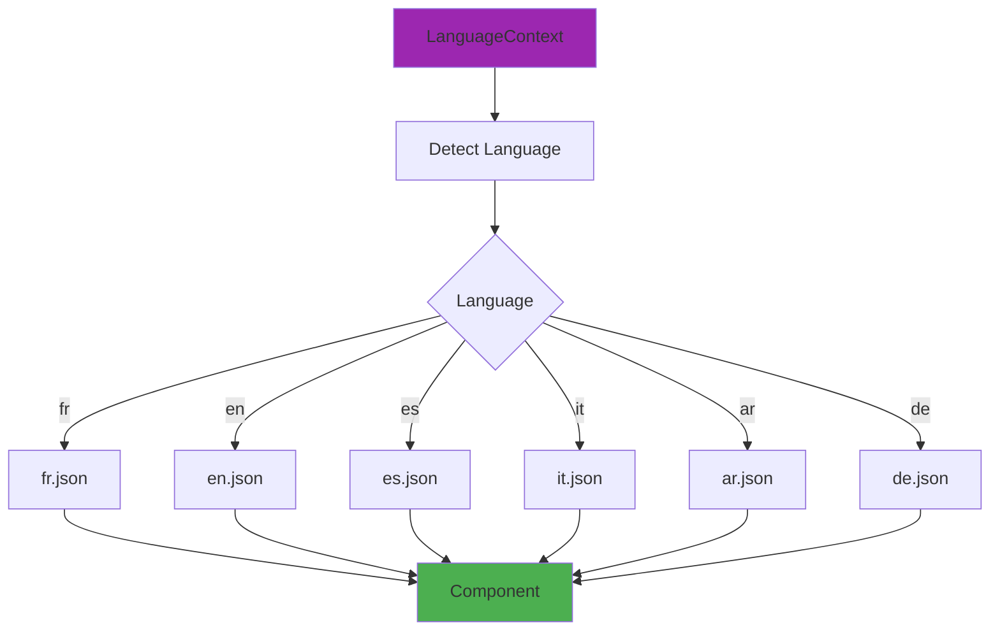

**Langues supportées**:
- 🇫🇷 Français (fr) - Par défaut
- 🇬🇧 Anglais (en)
- 🇪🇸 Espagnol (es)
- 🇮🇹 Italien (it)
- 🇸🇦 Arabe (ar)
- 🇩🇪 Allemand (de)

---

## Modes de Fonctionnement

### Mode Démo

L'application peut fonctionner en mode démo sans base de données :

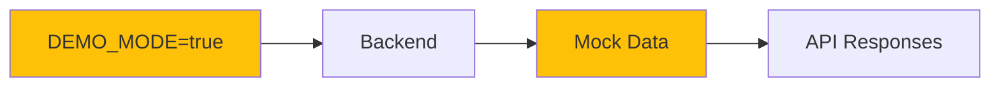

**Caractéristiques**:
- ✅ Fonctionne sans MongoDB
- ✅ Utilise des données de démonstration
- ✅ Parfait pour le développement et les démos
- ✅ Toutes les fonctionnalités disponibles

### Mode Production

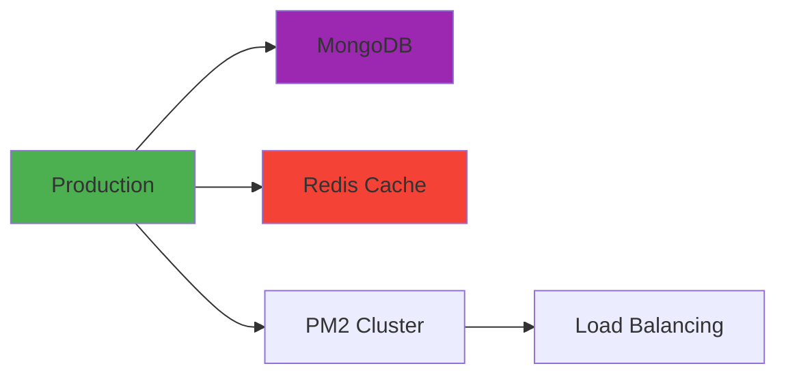

**Optimisations**:
- ✅ PM2 pour la gestion des processus
- ✅ Redis pour le cache et les sessions
- ✅ Clustering Socket.io avec Redis Adapter
- ✅ Rate limiting avancé
- ✅ Logging structuré
- ✅ Monitoring et health checks

---

## Déploiement

### Architecture de Déploiement

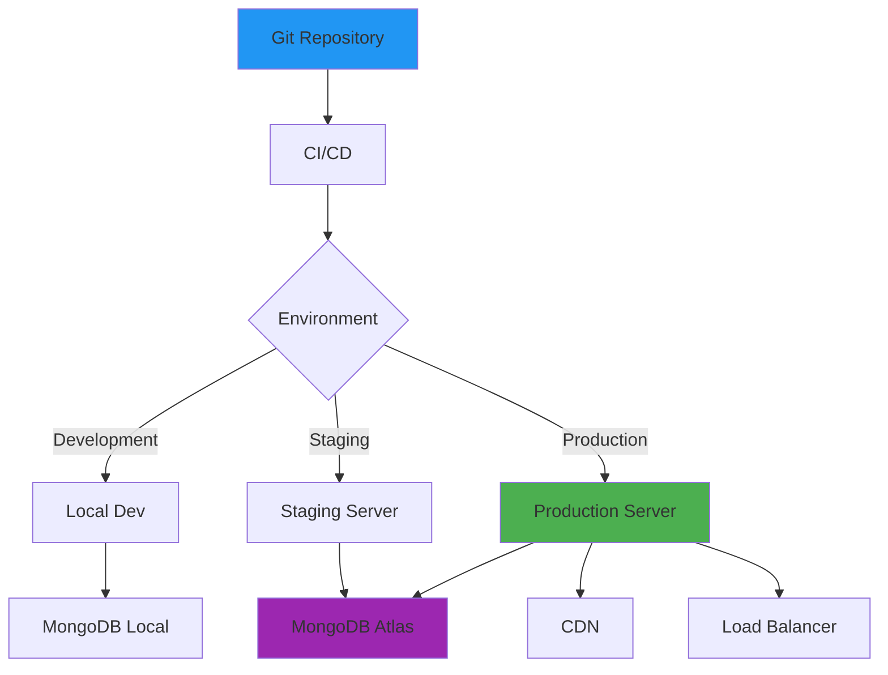

### Plateformes Supportées

- ✅ **Local Development** - npm scripts
- ✅ **Railway** - railway.json
- ✅ **Render** - render.yaml
- ✅ **Fly.io** - fly.toml
- ✅ **Koyeb** - koyeb.yaml
- ✅ **Cyclic** - cyclic.json
- ✅ **Vercel** - vercel.json
- ✅ **Docker** - Docker Compose pour MongoDB et Redis uniquement (pas de conteneur app) ; déploiement app = PM2 sur l’OS
- ✅ **PM2** - ecosystem.production.cjs

---

## Scripts de Démarrage

### Scripts Disponibles

| Script | Description |
|--------|-------------|
| `start-all.sh` | Lance tous les services (backend, frontend, dashboard) |
| `start-optimized.sh` | Démarrage optimisé avec PM2 |
| `npm run dev` | Démarrage frontend en mode dev |
| `npm run dev` (backend) | Démarrage backend avec nodemon |
| `npm run build` | Build production frontend |
| `npm run preview` | Preview build production |

---

## Ports et URLs

| Service | Port | URL |
|---------|------|-----|
| Backend API | 3000 | http://localhost:3000 |
| Frontend Principal | 5173 | http://localhost:5173 |
| Dashboard Admin | 5174 | http://localhost:5174 |
| MongoDB | 27017 | mongodb://localhost:27017 |
| Redis | 6379 | redis://localhost:6379 |

---

## Flux de Données Complet

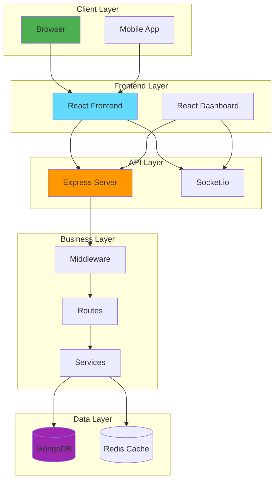

---

## Performance et Optimisations

### Optimisations Implémentées

1. **Caching**
   - Redis pour le cache des requêtes fréquentes
   - Cache-manager pour la gestion du cache

2. **Database**
   - Index MongoDB optimisés
   - Connection pooling
   - Requêtes optimisées avec Mongoose

3. **Frontend**
   - Code splitting avec Vite
   - Lazy loading des composants
   - Optimisation des images

4. **Backend**
   - Rate limiting
   - Compression des réponses
   - Pagination des résultats

---

## Monitoring et Logging

### Health Checks

- `/api/health` - Statut de l'API
- Monitoring PM2 (si utilisé)
- Logs structurés avec Morgan

### Métriques

- Uptime
- Nombre de connexions
- Taux de requêtes
- Erreurs et exceptions

---

## Conclusion

Cette architecture modulaire et scalable permet :

✅ **Séparation des responsabilités** - Frontend, Backend, Dashboard séparés  
✅ **Scalabilité** - Support de 2000+ connexions simultanées  
✅ **Maintenabilité** - Code organisé et documenté  
✅ **Flexibilité** - Mode démo et production  
✅ **Sécurité** - Multiples couches de sécurité  
✅ **Internationalisation** - Support multilingue  
✅ **Temps réel** - WebSocket pour les mises à jour instantanées  

---

*Document généré le 6 février 2026*
