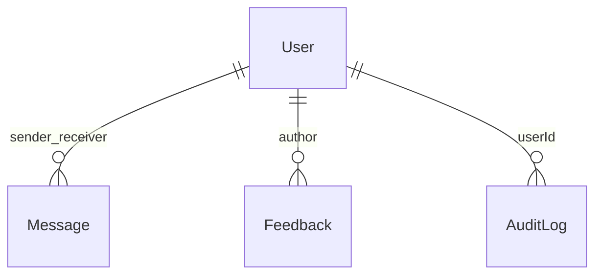

# Schéma de données MongoDB — vue d’ensemble

La persistance métier utilise **Mongoose** ; les fichiers canoniques sont dans **`backend/src/models/`** (quelques schémas historiques peuvent exister dans `backend/models/`).

## Collections principales (modèles)

| Collection / modèle                    | Fichier                                    | Rôle court                             |
| -------------------------------------- | ------------------------------------------ | -------------------------------------- |
| `users`                                | `User.js`                                  | Comptes passagers / équipage / admin   |
| `messages`                             | `Message.js`                               | Chat passager (sender/receiver → User) |
| `feedback`                             | `Feedback.js`                              | Tickets / retours                      |
| `auditlogs`                            | `AuditLog.js`                              | Traçabilité actions admin              |
| `restaurants`                          | `Restaurant.js`                            | Restaurants, menus                     |
| `articles`                             | `Article.js`                               | Magazine                               |
| `movies`                               | `Movie.js`                                 | Films & séries                         |
| `products`                             | `Product.js`                               | Shop                                   |
| `promotions`                           | `Promotion.js`                             | Promotions shop                        |
| `notifications`                        | `Notification.js`                          | Notifications                          |
| `radioStations`                        | `RadioStation.js`                          | Stations radio                         |
| `webtvchannels`                        | `WebTVChannel.js`                          | Chaînes WebTV                          |
| `banners`                              | `Banner.js`                                | Bannières                              |
| `ships`, `shipmaps`                    | `Ship.js`, `Shipmap.js`                    | Navires, plans de pont                 |
| `enfantactivities`                     | `EnfantActivity.js`                        | Espace enfant                          |
| `ads`, `trailers`, `destinations`      | divers                                     | Contenu / pub                          |
| `hostingservers`, `localserverconfigs` | `HostingServer.js`, `LocalServerConfig.js` | Config serveur / embarqué              |

> Liste exacte : `ls backend/src/models/*.js`.

## Diagramme conceptuel (ERD simplifié)

Relations logiques les plus utilisées ; MongoDB reste **schemaless** au niveau documents — les `ref` Mongoose documentent les liens.



Pour le détail des champs, **ouvrir le fichier `.js`** du modèle : chaque schéma liste les types, validations et sous-documents.

## Stratégie d’index

1. **Unicité / recherche** : ex. `User.email` (unique), index composés sur `Message` pour les conversations :

   ```js
   // Message.js — extrait
   messageSchema.index({ sender: 1, receiver: 1, createdAt: -1 });
   messageSchema.index({ receiver: 1, isRead: 1 });
   messageSchema.index({ sender: 1, clientSyncId: 1 }, { unique: true, sparse: true });
   ```

2. **Audit** : index sur `userId`, `action`, `timestamp` — voir `AuditLog.js`.

3. **Listes paginées** : souvent `createdAt`, ou champs filtrés (statut, shipId, etc.) — vérifier chaque modèle pour `.index(...)`.

4. **Performance sous charge** : [PERFORMANCE.md](./PERFORMANCE.md) (lectures `secondaryPreferred`, cache Redis sur certaines listes).

## Outils

- **Compass** : inspection des collections et des index réels sur l’instance.
- **OpenAPI** : contrat HTTP, pas le schéma BSON complet — voir [API-SCHEMA.md](./API-SCHEMA.md).

## Références

- [BACKEND-PRISMA.md](./BACKEND-PRISMA.md) — rôle Prisma vs Mongoose dans le projet
- [DOCUMENTATION-HUB.md](./DOCUMENTATION-HUB.md)
